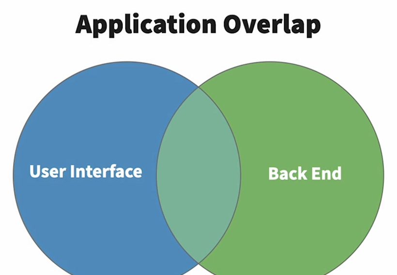
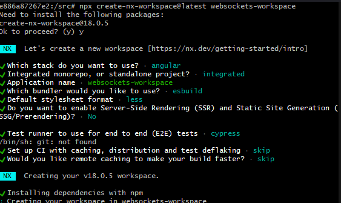
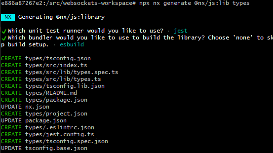

# Contextualization

One common challenge we might run across when developing a UI and it's back end, is that while they are separate applications, many of the data construct they need overlap.



For instance, both apps will need a `User` object. Where do we define this object? In both, the UI and the back end? This carries significant risks that the two codebases will diverge, we have to always remember to make a change to one whenever we make a change to the other.

> Codebase divergence can lead to major issues when overlapping classes are defined more than once.

A better approach is to create a shared library of types that both applications can import and use. This will allow us to have a single definition for all shared assets. As a bonus, it's easy.

## Setting development environment

The application will run on a container. After installation of Docker we mount an image based on `node:18-alpine`.

The Dockerfile at this moment should look like this:
```dockerfile
FROM node:18-alpine
COPY ./src ./src
WORKDIR /src
RUN apk add --no-cache bash
CMD ["/bin/sh"]
ENTRYPOINT bash
```

Build the image by runing:
```cmd
docker build -t <image-name> . 
```

Then start container:
```cmd
docker run --rm -i -t <image-name>
```

Or with container id:
```cmd
docker exec -it <container-id> bash
```

------
#### Shared Library

Independent resource used to create a single definition of classes and assets that are shared across applications.

- Easily propagate changes across applications
- Increase application compatibility

------

To create our shared library we'll run the following script:

```bash
npx create-nx-workspace@latest websockets-workspace
cd websockets-workspace
npx nx generate @nx/js:lib types
```

First we create a workspace leveraging the [Nx](https://nx.dev) build system generator. The particular generator we're using here comes from the `Nx` workspace package, and it's called `library`. And `types` is just the name of our generated library

<figure>

<figcaption style="text-align: center;">Creating Nx Workspace</figcaption>
</figure>

<figure>

<figcaption style="text-align: center;">Generating Types Lib</figcaption>
</figure>

`Nx` has created all the files that we need to have our library running. Let's explore `tsconfig.base.json` file.

```bash
cat tscofing.base.json
```

Expected output
```json
{
  "compileOnSave": false,
  "compilerOptions": {
    "rootDir": ".",
    "sourceMap": true,
    "declaration": false,
    "moduleResolution": "node",
    "emitDecoratorMetadata": true,
    "experimentalDecorators": true,
    "importHelpers": true,
    "target": "es2015",
    "module": "esnext",
    "lib": ["es2020", "dom"],
    "skipLibCheck": true,
    "skipDefaultLibCheck": true,
    "baseUrl": ".",
    "paths": {
      "@websockets-workspace/types": ["types/src/index.ts"]
    }
  },
  "exclude": ["node_modules", "tmp"]
}
```

Whenever a library is added using `@nx/js:lib`, `Nx` will add a path to this library entry point in the `paths` object. Our library package name is `@websockets-workspace/types`, so any application that is importing an object from our library can just import it from this package.

The library source file themselves are within the `libs/types` folder. Everything called from there goes inside the `src` folder and `index.ts` is the library entry point. Anything we export from this file will be available to external packages.

Let's start by adding the `User` object. Here's how our `user.ts` should look like in the path `libs/types/src/lib/user.ts`, you can delete any other files that may be inside this path.

```typescript
export interface User {}
```

And now we update our entry point at path `libs/types/src/index.ts`.

```typescript
export * from './lib/user';
```

Now `User` interface is available to everyone. Our next step will be run a lint check on our workspace.

```bash
npx nx lint types
```

We can achieve the same result by adding a script into our `package.json` file on path `websockets-workspace`.

```json
{
  "name": "@websockets-workspace/source",
  "version": "0.0.0",
  "license": "MIT",
  "scripts": {
    "types:lint": "nx lint types"
  },
  "private": true,
  "dependencies": {
    "@angular/animations": "~17.1.0",
    "@angular/common": "~17.1.0",
    "@angular/compiler": "~17.1.0",
    "@angular/core": "~17.1.0",
    "@angular/forms": "~17.1.0",
    "@angular/platform-browser": "~17.1.0",
    "@angular/platform-browser-dynamic": "~17.1.0",
    "@angular/router": "~17.1.0",
    "@nx/angular": "18.0.5",
    "rxjs": "~7.8.0",
    "tslib": "^2.3.0",
    "zone.js": "~0.14.3"
  },
  "devDependencies": {
    "@angular-devkit/build-angular": "~17.1.0",
    "@angular-devkit/core": "~17.1.0",
    "@angular-devkit/schematics": "~17.1.0",
    "@angular-eslint/eslint-plugin": "~17.0.0",
    "@angular-eslint/eslint-plugin-template": "~17.0.0",
    "@angular-eslint/template-parser": "~17.0.0",
    "@angular/cli": "~17.1.0",
    "@angular/compiler-cli": "~17.1.0",
    "@angular/language-service": "~17.1.0",
    "@nx/cypress": "18.0.5",
    "@nx/esbuild": "18.0.5",
    "@nx/eslint": "18.0.5",
    "@nx/eslint-plugin": "18.0.5",
    "@nx/jest": "18.0.5",
    "@nx/js": "18.0.5",
    "@nx/web": "18.0.5",
    "@nx/workspace": "18.0.5",
    "@schematics/angular": "~17.1.0",
    "@swc-node/register": "~1.8.0",
    "@swc/core": "~1.3.85",
    "@swc/helpers": "~0.5.2",
    "@types/jest": "^29.4.0",
    "@types/node": "18.16.9",
    "@typescript-eslint/eslint-plugin": "^6.13.2",
    "@typescript-eslint/parser": "^6.13.2",
    "cypress": "13.6.4",
    "esbuild": "^0.19.2",
    "eslint": "~8.48.0",
    "eslint-config-prettier": "^9.0.0",
    "eslint-plugin-cypress": "^2.13.4",
    "jest": "^29.4.1",
    "jest-environment-jsdom": "^29.4.1",
    "jest-environment-node": "^29.4.1",
    "jest-preset-angular": "~13.1.4",
    "jsonc-eslint-parser": "^2.1.0",
    "nx": "18.0.5",
    "prettier": "^2.6.2",
    "ts-jest": "^29.1.0",
    "ts-node": "10.9.1",
    "typescript": "~5.3.2"
  }
}
```

Then running:

```bash
npm run types:lint
```

Expected output:
```cmd
/src/websockets-workspace/types/src/lib/user.ts
  1:18  error  An empty interface is equivalent to `{}`  @typescript-eslint/no-empty-interface
```

Seems like it's not happy about something. Linting rules require interface to not be empty, and that what we just do. Let's modify `user.ts` to look as the following:

```typescript
export interface User {
    name: string,
    id: number
}
```

Expected output:
```cmd
 NX   Successfully ran target lint for project types (1s)
```

Now with our library in place, whenever we make a change to a shared type it'll be a lot easier to propagate that change to all our applications, because it will all be importing from the common source of truth.
